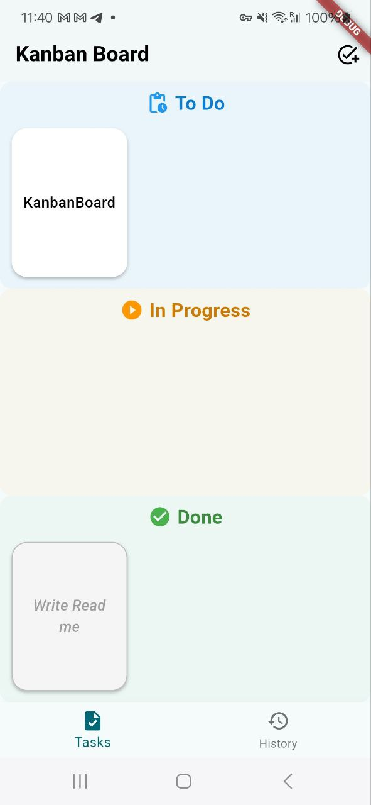
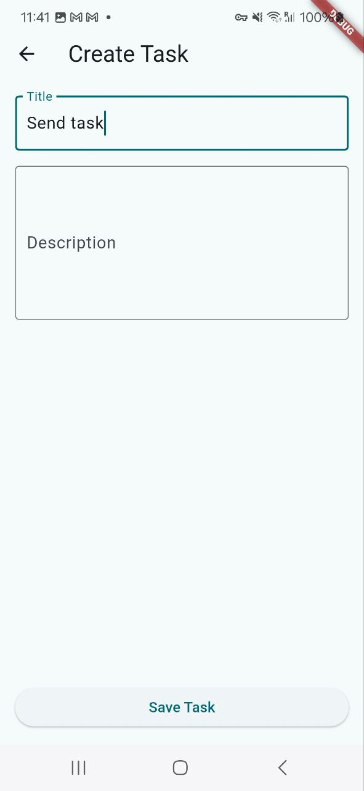
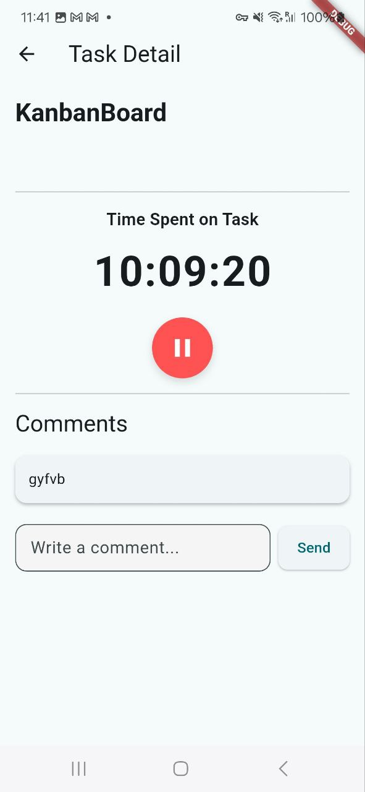
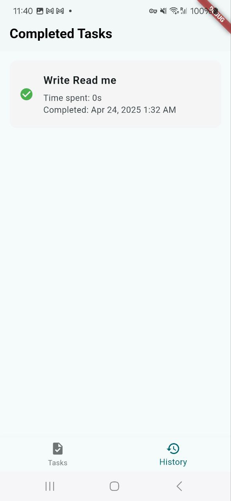

# Flutter Todoist Time Tracking App


This project is a **Time Tracking Kanban Board App** built with Flutter for a take-home challenge.

It focuses on:

- ✅ Clean Architecture implementation
- ✅ SOLID principles and Test-Driven Development (TDD)
- ✅ Emphasis on core Software Engineering best practices

## 🧪 Take-Home Challenge Expectations

The goal of this take-home challenge is to build a **Task Time Tracking Application** using Flutter, centered around a Kanban board layout and integrating with the [Todoist REST API v2](https://developer.todoist.com/rest/v2/#overview).

If the functionality that you want to implement is not provided by the API services, use local solutions as needed.


---

### ✅ Core Features

1. **Kanban Board**
   - Display tasks in three columns: `To Do`, `In Progress`, and `Done`.
   - Users able to:
      - Create new tasks
      - Move tasks between columns to reflect progress



2. **Task Timer**
   - Each task has a timer feature to track time spent.
   - Users should be able to start and stop the timer.

4. **Task Comments**
    - Allow users to add comments to individual tasks
    - Display existing comments for each task



3. **Completed Task History**
   - Provide a history view of all completed tasks.
   - Each completed task shows:
      - Time spent
      - Completion date



5. **Caching Mechanism** *(Bonus)*
   - Implemented a caching layer to persist and retrieve task data efficiently
   - Enhances performance and provides offline-read support
---

### 🔌 API Usage Guidelines

- Use the Todoist REST API: [https://developer.todoist.com/rest/v2](https://developer.todoist.com/rest/v2)
- **Authentication** is **not required**  
  ➤ Use a **Test Token** available via the [App Management Console](https://todoist.com/prefs/integrations)

- If a required feature is **not provided** by the Todoist API:  
  ➤ Implement it using **local storage or logic**  
  (e.g., timer tracking and comments can be stored locally)

---

### 📝 Notes

- Focus on **clean code**, **best practices**, and **user-centered design**.
- Use **SOLID principles**, **MVP**, and optionally **Clean Architecture**.
- Performance and maintainability are key.
- Bonus for writing **unit tests** and using **TDD** principles.

---

Good luck, and have fun building! 🚀

---

## ✨ Features

### ✅ Functional Requirements

1. **Kanban Board**
   - Create, edit, delete, and move tasks between columns (`To Do`, `In Progress`, `Done`).

2. **Task Timer**
   - Start/stop time tracking on tasks.
   - View total tracked time.

3. **Completed Task History**
   - View completed tasks, time spent, and completion date.

4. **Comments**
   - Add and view comments on each task.

---

## 🚀 Getting Started

### ✅ Prerequisites

- Flutter (latest stable version)
- Dart SDK
- An IDE (Android Studio or VS Code)
- Internet access (for Todoist API)

### 🔧 Setup

1. **Clone the repo**:
   ```bash
   git clone https://github.com/farzaamam/flutter_todoist.git
   cd flutter_todoist